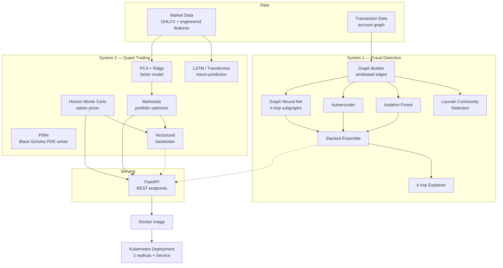
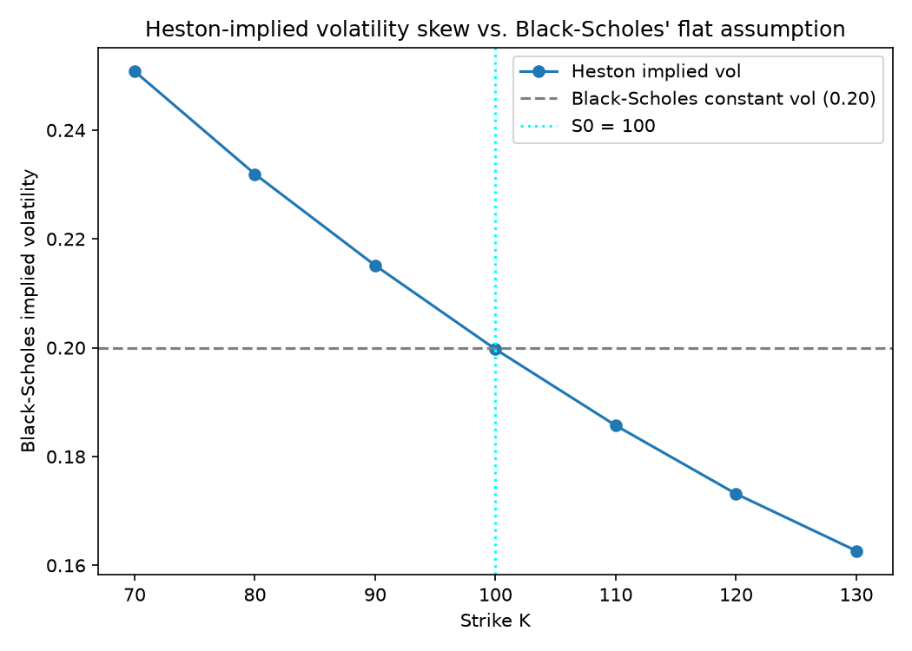

# Financial AI System

**A real-time transaction fraud detection engine and a quantitative ML trading research platform, sharing a common infrastructure layer and served through a unified REST API.**


---

## Overview

This repository contains two independent modeling systems that share a common data, infrastructure, and deployment layer:

- **System 1 — Fraud Detection.** A graph-aware anomaly detection pipeline that scores transactions using a stacked ensemble (Isolation Forest + Autoencoder + Graph Neural Network), with Louvain community detection over the transaction graph for ring-fraud discovery and a k-hop subgraph explainer for individual alerts.
- **System 2 — Quantitative Trading & Derivatives Pricing.** A suite of independently-validated quantitative finance models: a physics-informed neural network that learns to solve the Black-Scholes PDE directly, LSTM/Transformer sequence models for return prediction, a Monte Carlo Heston stochastic-volatility option pricer, a PCA/Ridge statistical factor model, Markowitz mean-variance portfolio optimization, and a lookahead-bias-safe vectorized backtesting engine.

Every quantitative component in System 2 ships with a numerical correctness check against a known closed-form solution or an internally consistent invariant (e.g. the Heston model is checked against Black-Scholes in the zero-vol-of-vol limit; the backtester is checked against a synthetic lookahead-bias injection). Results below are reported as measured, including where a model underperforms a baseline — see [Validation Methodology](#validation-methodology).

---

## Architecture



---

## System 1: Fraud Detection

The fraud pipeline treats each transaction as an edge in a temporal graph between accounts, rather than scoring transactions in isolation:

- **Graph construction** (`src/shared/graph_utils.py`): transactions are windowed into time buckets and turned into a graph via `build_windowed_edges` / `build_graph_from_edges`.
- **Community detection**: Louvain modularity optimization (`detect_communities`) surfaces tightly-connected account clusters, a strong signal for coordinated fraud rings that per-transaction scoring alone misses.
- **Anomaly scoring** (`src/shared/anomaly_core.py`): three independent scorers are computed and combined —
  - **Isolation Forest**, a fast tree-based unsupervised baseline;
  - an **Autoencoder**, flagging transactions with high reconstruction error;
  - a **Graph Neural Network**, operating on k-hop subgraphs (`extract_k_hop_subgraph`, via PyTorch Geometric) so each account's score reflects its local network structure, not just its own features.
- **Ensemble**: scores are rank-normalized (`rank_normalize`) before combination, since the three scorers operate on incompatible raw scales, then combined by a `StackedEnsemble`.
- **Evaluation**: models are compared against a Random Forest supervised baseline using precision-at-fixed-false-positive-rate (`precision_at_fpr`) rather than raw accuracy, since fraud is a heavily imbalanced classification problem where accuracy is a misleading metric. In this evaluation, the simpler Random Forest baseline outperformed the GNN — a useful reminder that architectural complexity needs to earn its keep empirically, not be assumed.
- **Explainability**: individual fraud alerts can be explained by extracting and inspecting the k-hop subgraph around the flagged account, rather than treating the ensemble as a black box.

---

## System 2: Quantitative Trading & Derivatives Pricing

Full derivations for every model below live in [`notebooks/math_derivations.ipynb`](notebooks/math_derivations.ipynb). This section summarizes the core equations and the measured results.

### 2.1 Physics-Informed Neural Network for Option Pricing

Rather than learning from a dataset of priced options, this model is trained to directly satisfy the Black-Scholes partial differential equation as a soft constraint, using automatic differentiation to compute the PDE residual at randomly sampled collocation points:

$$\frac{\partial V}{\partial t} + \frac{1}{2}\sigma^2 S^2 \frac{\partial^2 V}{\partial S^2} + rS\frac{\partial V}{\partial S} - rV = 0$$

subject to the terminal payoff condition $V(S, T) = \max(S - K, 0)$. The network is trained by minimizing a composite loss $\mathcal{L} = \mathcal{L}_{\text{PDE}} + \mathcal{L}_{\text{terminal}}$, with the output non-dimensionalized as $V(S,t) = K \cdot \hat{V}_\theta(S,t)$ to keep loss terms on comparable numerical scales, and optimized with Adam followed by L-BFGS for final convergence.

**Result:** 4.77% mean relative error against the closed-form Black-Scholes price across the test grid.

A hard-constraint trial-solution ansatz (forcing the terminal condition exactly, per Lagaris et al. 1998) and a causal/curriculum training schedule (Wang et al. 2022) were both evaluated as alternatives — both *increased* error to the 7–13.5% range by shifting the error concentration to $t=0$ (today's price, the value that matters most), so the simpler soft-constraint formulation was kept as the production model. This comparison is documented in full in the notebook.

### 2.2 Sequence Models: LSTM & Transformer Return Prediction

Both architectures predict next-day returns from 30-day trailing windows of engineered features (realized volatility, momentum, RSI, volume z-score, and price/moving-average *ratios* — raw price levels are deliberately excluded as features, since they let a pooled multi-ticker model shortcut on ticker identity rather than learning transferable return dynamics). Data is split by date, not randomly, to prevent lookahead leakage; the scaler is fit on the training split only.

| Model | Directional Accuracy | Information Coefficient |
|---|---|---|
| LSTM | 52.55% | 0.084 |
| Transformer | 51.08% | 0.0039 |

Both narrowly beat random-chance directional accuracy (50%); the LSTM shows a modest but real signal (IC ≈ 0.08 is a meaningful value by quant-industry convention), while the Transformer's much weaker IC is consistent with it needing more training data than was available here to realize its capacity advantage.

### 2.3 Heston Stochastic Volatility Model

Unlike Black-Scholes, the Heston model treats variance itself as a mean-reverting stochastic process, which lets it reproduce the volatility smile/skew observed in real option markets instead of assuming one constant volatility:

$$dS_t = rS_t\,dt + \sqrt{v_t}\,S_t\,dW_t^S$$

$$dv_t = \kappa(\theta - v_t)\,dt + \sigma_v\sqrt{v_t}\,dW_t^v, \qquad \mathrm{Corr}(dW_t^S, dW_t^v) = \rho\,dt$$

There is no closed-form European option price under Heston, so it's priced by Monte Carlo simulation using a full-truncation Euler-Maruyama discretization (Lord, Koekkoek & van Dijk, 2010), which floors variance at zero wherever it's used to prevent the discretized process from going negative. Implied volatilities are then backed out by inverting Black-Scholes via Brent's method.

**Correctness check:** as $\sigma_v \to 0$ with $v_0 = \theta$, the model must collapse to plain Black-Scholes — verified within Monte Carlo standard error.

**Result — implied volatility skew (κ=2.0, θ=0.04, σᵥ=0.3, ρ=−0.7):**



The negative price/variance correlation produces the downward-sloping skew characteristic of equity index options — out-of-the-money puts trade at higher implied volatility than the flat Black-Scholes assumption would predict.

### 2.4 Statistical Factor Model

A PCA-based factor model with Ridge-regularized factor loadings reconstructs the asset covariance matrix as:

$$\Sigma = B \Omega B^\top + D$$

where $B$ are the (Ridge-regularized) factor loadings, $\Omega$ is the factor covariance, and $D$ is a diagonal idiosyncratic variance matrix. **Result:** the first two principal factors explain roughly 80% of cross-sectional return variance on real market data, and the reconstructed covariance matrix is verified positive semi-definite — the property that actually matters for downstream portfolio optimization, rather than a condition-number comparison against the sample covariance (which is a misleading test whenever the observation count comfortably exceeds the asset count).

### 2.5 Markowitz Mean-Variance Portfolio Optimization

Both the minimum-variance and maximum-Sharpe portfolios are solved two ways: in closed form via the two-fund separation theorem, and numerically via constrained quadratic optimization (for the realistic long-only case). Closed-form and numerical solutions agree to within 3×10⁻⁷ on the unconstrained problem — the sanity check that catches solver configuration bugs (an early version of this code incorrectly hard-bounded weights to [−1, 1] even in the "unconstrained" branch, silently producing wrong answers whenever the true optimum required leverage).

$$\min_w \tfrac{1}{2} w^\top \Sigma w \quad \text{s.t.} \quad w^\top \mu = r_{\text{target}}, \quad w^\top \mathbf{1} = 1$$

### 2.6 Risk Analytics

Standard risk-adjusted return and tail-risk metrics, computed both empirically (historical) and parametrically (Gaussian):

$$\text{Sharpe} = \frac{R_p - R_f}{\sigma_p} \qquad \text{Sortino} = \frac{R_p - R_f}{\sigma_{\text{downside}}}$$

Value-at-Risk and Conditional Value-at-Risk (Expected Shortfall) are computed at a configurable confidence level, with the invariant $\text{CVaR} \geq \text{VaR}$ enforced as a correctness check on every run.

### 2.7 Vectorized Backtesting Engine

The backtesting engine applies portfolio weights with an explicit one-day lag (`weights.shift(1)`) so that a strategy can only trade on information available *before* the return it's being scored against — the lag is implemented in exactly one place in the codebase specifically to prevent the double-lag / no-lag bugs that are easy to introduce when signal generation and execution are lagged independently. Correctness is verified with an intentional lookahead-bias injection test that must fail obviously (and does) when lookahead is present.

**Result:** the momentum-based strategies tested underperformed a buy-and-hold benchmark over the evaluation window — reported as measured rather than adjusted to look favorable, consistent with this project's validation philosophy.

---

## Validation Methodology

Every model in this repository is checked against something independent of its own training process before being reported as working: a closed-form solution (Black-Scholes, for both the PINN and the Heston zero-vol-of-vol limit), an intentionally-injected bug that the test must catch (lookahead bias in the backtester, unconstrained-vs-bounded optimizer agreement in portfolio optimization), a hard mathematical invariant (positive semi-definiteness of a reconstructed covariance matrix, CVaR ≥ VaR), or a baseline comparison rather than an absolute performance claim (LSTM/Transformer vs. random chance, GNN vs. Random Forest, momentum strategy vs. buy-and-hold). Where a result is weak or a model underperforms, that is reported as-is rather than adjusted to look favorable.

---

## API

A FastAPI service exposes the quantitative models as stateless REST endpoints (fraud-scoring endpoints are intentionally not yet included, pending trained-model checkpoint persistence).

| Method | Endpoint | Description |
|---|---|---|
| `GET` | `/health` | Liveness/readiness check |
| `POST` | `/quant/black-scholes` | Closed-form European option pricing |
| `POST` | `/quant/heston-smile` | Monte Carlo Heston pricing + implied vol across strikes |
| `POST` | `/quant/portfolio/optimize` | Min-variance and max-Sharpe portfolio weights (rejects non-PSD covariance inputs with HTTP 422) |
| `POST` | `/quant/risk-report` | Sharpe, Sortino, VaR, CVaR from a return series |

```bash
curl -X POST http://localhost:8000/quant/black-scholes \
  -H "Content-Type: application/json" \
  -d '{"spot": 100, "strike": 100, "maturity": 1, "rate": 0.05, "sigma": 0.2}'
# {"price":10.450583572185565}
```

Interactive Swagger docs are available at `/docs` once the service is running.

---

## Infrastructure & Deployment

- **Containerization**: a purpose-built Docker image (`Dockerfile`) includes only the API's actual runtime dependencies (`requirements-api.txt`) — heavier training-only dependencies like PyTorch are deliberately excluded from the serving image, keeping it lean and fast to build.
- **Orchestration**: `k8s/deployment.yaml` and `k8s/service.yaml` deploy the API as a 2-replica Kubernetes Deployment with liveness/readiness probes against `/health`, fronted by a NodePort Service — verified against a local minikube cluster running on the Docker driver.

---

## Tech Stack

| Category | Tools |
|---|---|
| Language | Python 3.13 |
| Deep Learning | PyTorch, PyTorch Geometric |
| Classical ML | scikit-learn (Isolation Forest, Random Forest, Ridge, StandardScaler) |
| Numerical / Scientific | NumPy, SciPy (optimization, Brent's method root-finding, statistical distributions) |
| Data | pandas |
| Graph Analysis | NetworkX (Louvain community detection) |
| API | FastAPI, Pydantic v2, Uvicorn |
| Visualization | Matplotlib |
| Notebooks | Jupyter, nbformat |
| Containerization | Docker |
| Orchestration | Kubernetes (minikube) |
| Version Control | Git / GitHub |

---

## Project Structure

```
financial-ai-system/
├── src/
│   ├── fraud/           # System 1: baseline, ensemble, graph, GNN, explainability
│   ├── quant/            # System 2: PINN, sequence models, Heston, factor model,
│   │                     # portfolio optimization, risk, backtesting
│   ├── shared/            # Generalized anomaly-scoring & graph utilities used by System 1
│   ├── api/                # FastAPI application and route definitions
│   ├── agents/              # Reserved for future agentic orchestration (not yet implemented)
│   └── monitoring/           # Reserved for observability hooks (not yet implemented)
├── k8s/                       # Kubernetes Deployment + Service manifests
├── notebooks/                  # Full mathematical derivations
├── tests/                       # Test package scaffold (no tests implemented yet)
├── docs/assets/                  # README figures
├── Dockerfile
├── requirements.txt              # Full research/training environment
└── requirements-api.txt          # Minimal serving environment
```

---

## Getting Started

```bash
# Clone and set up the environment
git clone https://github.com/rkazumovi/financial-ai-system.git
cd financial-ai-system
python -m venv venv
venv\Scripts\activate          # Windows
pip install -r requirements.txt

# Run the API locally
uvicorn src.api.main:app --reload --port 8000

# Or via Docker
docker build -t financial-ai-api .
docker run -d -p 8000:8000 financial-ai-api

# Or via Kubernetes (minikube)
minikube start --driver=docker
minikube image load financial-ai-api:latest
kubectl apply -f k8s/
```

---

## Roadmap

- Add an automated test suite (`tests/` currently ships as an empty package)
- Add a GitHub Actions CI workflow to run tests and validate the Docker build on every push
- Wire up Prometheus/Grafana observability (`src/monitoring/` is currently a placeholder)
- Add fraud-scoring API endpoints once trained-model checkpoint persistence is in place

---

## License

MIT — see [LICENSE](LICENSE).
